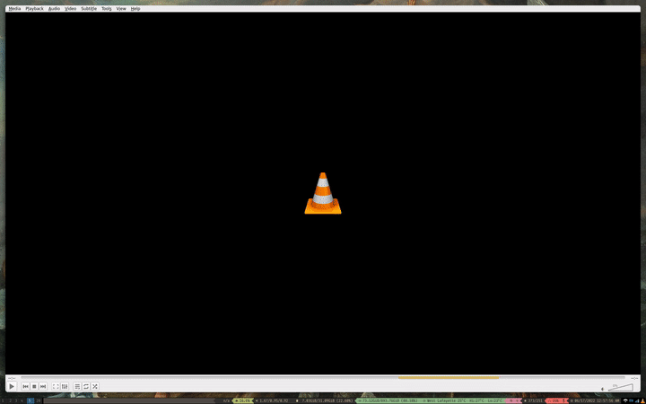

# code-decompiler README

This is SUPER WIP!!! Don't use it yet!

All that is working so far is:
* Create memfs to store decomp results
* Compile protobuf to talk to python decomp manager server
* Right click action to "Decompile" a file

# Dependencies

`python3 -m pip install grpcio-tools grpcio protobuf`
